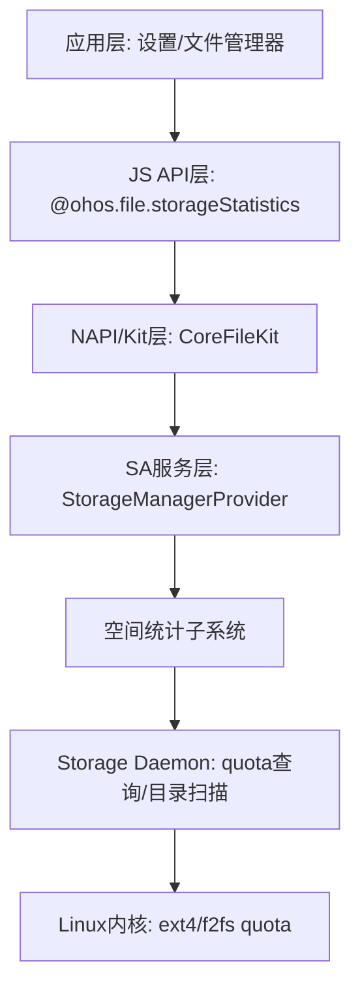
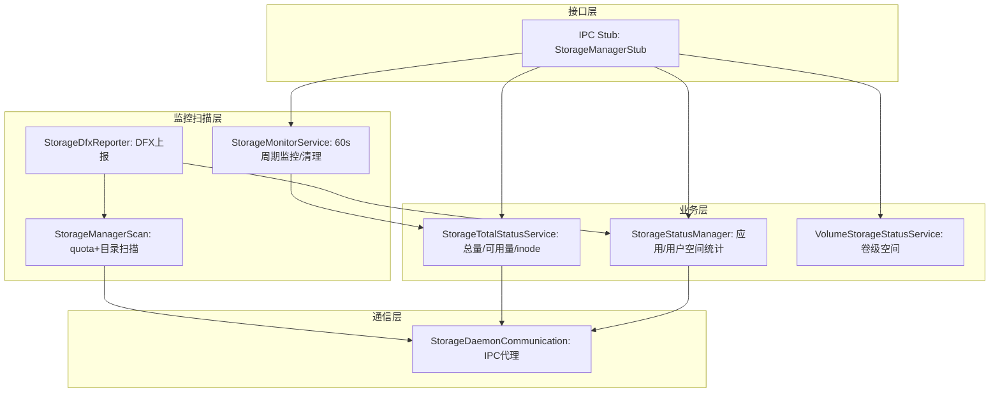

# 空间统计子系统架构总览

本文档描述 OpenHarmony storage_service 模块中空间统计子系统的整体架构设计，包括模块在系统栈中的位置、内部分层结构、核心模块职责以及外部依赖关系。

## 1. 模块在系统栈中的位置

空间统计子系统位于 storage_manager 服务内部，向上通过 SA 框架和 JS API 对应用层暴露空间查询与监控能力，向下通过 IPC 与 storage_daemon 交互获取内核级 quota 和磁盘空间数据。

## 2. 空间统计子系统内部分层

子系统内部按照职责划分为四个层次：接口层负责接收并反序列化 IPC 请求；业务层实现应用空间统计、总量统计和卷级统计三大核心能力；监控扫描层负责周期性磁盘监控、quota/目录扫描以及 DFX 数据上报；通信层封装与 storage_daemon 进程的 IPC 代理。

## 3. 核心模块职责矩阵

| 模块 | 关键类 | 职责 | 源码路径 |
|------|--------|------|----------|
| 应用空间统计 | StorageStatusManager | 查询应用appSize/cacheSize/dataSize，用户分类统计 | services/storage_manager/storage/src/storage_status_manager.cpp |
| 总量统计 | StorageTotalStatusService | 查询系统总空间/可用空间/总inode/可用inode | services/storage_manager/storage/src/storage_total_status_service.cpp |
| 卷级统计 | VolumeStorageStatusService | 查询外置卷设备的总空间/可用空间 | services/storage_manager/storage/src/volume_storage_status_service.cpp |
| 存储监控 | StorageMonitorService | 60秒周期监控磁盘空间，三级阈值告警，自动清理应用缓存 | services/storage_manager/storage/src/storage_monitor_service.cpp |
| 磁盘扫描 | StorageManagerScan | 通过quota查询+目录遍历统计root/system/memmgr占用 | services/storage_manager/scan/src/storage_manager_scan.cpp |
| DFX上报 | StorageDfxReporter | HAP/SA/目录统计，定时上报到雷达平台 | services/storage_manager/dfx_report/storage_dfx_reporter.cpp |
| IPC通信 | StorageDaemonCommunication | 与storage_daemon进程的IPC代理 | services/storage_manager/storage_daemon_communication/ |
| 包管理连接 | BundleManagerConnector | 与BundleMgr服务的IPC连接，查询应用空间 | services/storage_manager/storage/src/bundle_manager_connector.cpp |

## 4. 外部依赖概览

| 依赖模块 | 交互方式 | 调用的API | 用途 |
|----------|---------|-----------|------|
| storage_daemon | IPC (StorageDaemonCommunication) | GetQuotaSizeByUid, GetDirListSpace, GetTotalSize, GetFreeSize等 | 底层quota查询、目录扫描、空间统计 |
| BundleMgr | IPC (BundleManagerConnector) | GetBundleStats, CleanBundleCacheFilesAutomatic | 查询应用空间大小，清理应用缓存 |
| 媒体库(media_library) | DataShareHelper | 查询audio/video/image/file大小 | 用户存储分类统计 |
| samgr | SA框架 | 注册/发现SA | StorageManagerProvider作为SA注册 |
| CommonEventManager | 发布/订阅 | DEVICE_STORAGE_LOW, SMART_NOTIFICATION | 空间不足通知 |
| HiSysEvent | 雷达打点 | StorageRadar::ReportSpaceRadar | DFX统计上报 |
| 系统参数服务 | 参数读取 | const.storage_service.storage_alert_policy等 | 读取阈值配置 |

## 5. 兼容性声明

- **已有 API 行为变更:** 公共JS API（getCurrentBundleStats/getTotalSize/getFreeSize及其同步版本）的签名、返回值类型、错误码含义为稳定契约，不允许破坏性变更
- **配置文件格式变更:** 阈值参数格式（`notify_l:500M/notify_m:2G/...`）保持向后兼容，新增参数键不破坏旧键的解析
- **数据存储格式变更:** `scan_result.json` 的JSON字段结构（rootSize/systemSize/memmgrSize）为持久化契约，不可删除或重命名字段
- **IPC协议变更:** Inner API 的 Parcelable 序列化字段顺序不可变更，新增字段必须追加到末尾
