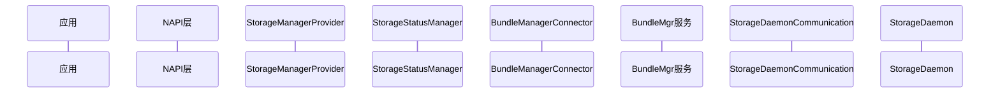
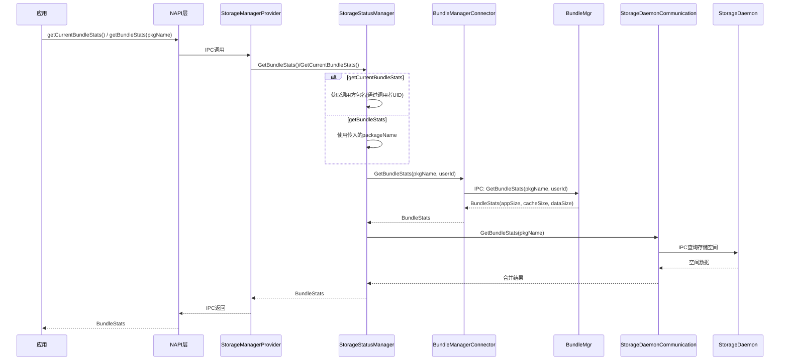

# 应用空间统计查询工作流

## 概述

查询应用存储空间占用（appSize/cacheSize/dataSize）的完整流程涉及两个 JS API：

- **getCurrentBundleStats**：公共 API，应用查询自身的存储空间占用，无需权限。
- **getBundleStats**：系统 API，查询指定应用的存储空间占用，需要 `ohos.permission.STORAGE_MANAGER` 权限。

两个 API 最终都会经过 StorageManagerService 的业务逻辑层，通过 BundleManagerConnector 从 BundleMgr 服务获取应用的包信息，并通过 StorageDaemonCommunication 从 StorageDaemon 获取底层存储空间数据，最终汇总返回 `BundleStats` 对象。

## 参与者



各参与者职责说明：

| 参与者 | 职责 |
|--------|------|
| 应用 | JS 应用层，调用存储空间查询 API |
| NAPI层 | JS API 的 C++ 绑定层，负责参数校验和 IPC 调用 |
| StorageManagerProvider | StorageManager 服务的 IPC 接口实现，负责请求分发 |
| StorageStatusManager | 存储状态管理器，核心业务逻辑层 |
| BundleManagerConnector | BundleMgr 服务的代理，负责与包管理服务通信 |
| BundleMgr服务 | 包管理服务，提供应用包的统计信息 |
| StorageDaemonCommunication | 与 StorageDaemon 进程的通信层 |
| StorageDaemon | 存储守护进程，提供底层存储空间查询能力 |

## 完整调用流程



### 流程步骤详解

**第一步：应用发起调用**

应用层通过 JS API 发起存储空间查询请求。`getCurrentBundleStats()` 无需参数，查询自身空间占用；`getBundleStats(pkgName)` 需要传入目标应用的包名。

**第二步：NAPI 层处理**

NAPI 层进行参数校验（如 `getBundleStats` 需校验权限），然后通过 IPC 将请求发送至 StorageManagerService。

**第三步：确定目标包名**

StorageStatusManager 根据调用的 API 类型确定目标包名：
- `getCurrentBundleStats`：通过调用者的 UID 反查包名
- `getBundleStats`：直接使用应用层传入的 `packageName`

**第四步：从 BundleMgr 获取统计数据**

通过 BundleManagerConnector 向 BundleMgr 服务发起 IPC 调用，获取应用的 `BundleStats` 信息，包括 appSize、cacheSize 和 dataSize。

**第五步：从 StorageDaemon 获取底层存储数据**

通过 StorageDaemonCommunication 向 StorageDaemon 进程查询实际的存储空间数据，与 BundleMgr 返回的结果进行合并。

**第六步：返回结果**

合并后的 `BundleStats` 对象沿调用链逐层返回，最终通过 NAPI 层将结果传递给 JS 应用。

## 分身应用查询流程（仅系统API）

`getBundleStats` 支持 `index` 参数（API 12+），用于查询分身应用的存储空间占用：

| index 值 | 含义 |
|-----------|------|
| 0 | 主应用（默认值） |
| >=1 | 分身应用，索引从 1 开始递增 |

分身索引可通过 `BundleResourceInfo.appIndex` 获取。使用示例：

```js
// 查询主应用
storageStatistics.getBundleStats("com.example.app", 0);

// 查询第一个分身应用
storageStatistics.getBundleStats("com.example.app", 1);
```

> **注意**：`getCurrentBundleStats` 不支持 index 参数，只能查询主应用自身的空间占用。

## 权限与错误处理

| API | 权限要求 | 系统接口 | 常见错误码 |
|-----|---------|---------|-----------|
| getCurrentBundleStats | 无 | 否 | 13600001（IPC错误）、13900042（未知错误） |
| getBundleStats | ohos.permission.STORAGE_MANAGER | 是 | 201（权限校验失败）、202（非系统应用调用）、13600001（IPC错误）、13600008（无此对象） |

### 错误码详细说明

| 错误码 | 名称 | 说明 |
|--------|------|------|
| 201 | 权限校验失败 | 应用未声明或未获得所需权限 |
| 202 | 非系统应用 | 系统 API 被非系统应用调用 |
| 13600001 | IPC 错误 | IPC 通信过程中发生错误 |
| 13600008 | 无此对象 | 指定包名的应用不存在 |
| 13900042 | 未知错误 | 其他未分类的内部错误 |

## 关键代码路径

| 流程 | 源码文件 |
|------|---------|
| JS API 入口 | `interfaces/kits/js/storage_manager/` |
| IPC 分发 | `services/storage_manager/ipc/src/storage_manager_provider.cpp` |
| 业务逻辑 | `services/storage_manager/storage/src/storage_status_manager.cpp` |
| BundleMgr 代理 | `services/storage_manager/storage/src/bundle_manager_connector.cpp` |
| Daemon 通信 | `services/storage_manager/storage_daemon_communication/` |
