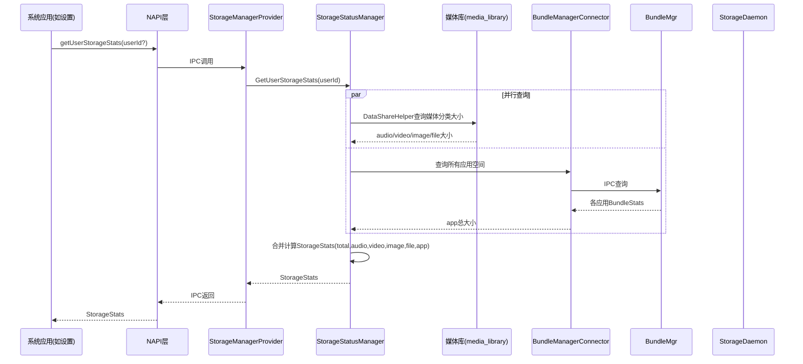

# 用户分类存储统计工作流

## 概述

本文档描述 `getUserStorageStats` 系统API查询用户存储按类型分类（audio/video/image/file/app）的完整流程。该API由系统应用（如设置应用）调用，通过NAPI层、StorageManagerProvider、StorageStatusManager等组件协同工作，分别从媒体库和BundleMgr获取各分类的存储大小，最终汇总返回完整的分类存储统计数据。

## 参与者与调用流程

### 流程说明

1. **系统应用发起调用**：系统应用（如设置）通过JS API `getUserStorageStats` 发起请求，可选传入 `userId` 参数指定目标用户。
2. **NAPI层转发**：NAPI层将JS调用转化为C++调用，通过IPC发送至StorageManagerProvider。
3. **IPC分发**：StorageManagerProvider接收IPC消息，调用StorageStatusManager的 `GetUserStorageStats` 方法。
4. **并行查询**：
   - **媒体分类查询**：StorageStatusManager通过DataShareHelper向媒体库（media_library）查询audio、video、image、file各类型的大小。
   - **应用空间查询**：StorageStatusManager调用BundleManagerConnector，后者通过IPC向BundleMgr查询所有应用的BundleStats，汇总得到app总大小。
5. **合并计算**：StorageStatusManager将各数据源返回的结果合并，构建完整的 `StorageStats` 对象（包含total、audio、video、image、file、app字段）。
6. **结果返回**：统计数据经由StorageManagerProvider、NAPI层逐级返回给调用方系统应用。

## 数据来源说明

| 字段 | 数据来源 | 查询方式 |
|------|---------|---------|
| total | StorageTotalStatusService | storage_daemon查询statfs |
| audio | 媒体库 | DataShareHelper按MEDIA_TYPE_AUDIO查询 |
| video | 媒体库 | DataShareHelper按MEDIA_TYPE_VIDEO查询 |
| image | 媒体库 | DataShareHelper按MEDIA_TYPE_IMAGE查询 |
| file | 媒体库 | DataShareHelper按MEDIA_TYPE_FILE查询 |
| app | BundleMgr | 汇总所有应用的appSize |

### 各字段详细说明

- **total**：通过StorageTotalStatusService调用storage_daemon，使用statfs系统调用获取存储分区的总空间使用量。
- **audio**：通过DataShareHelper向媒体库发起查询，以 `MEDIA_TYPE_AUDIO` 为过滤条件，统计所有音频文件的总大小。
- **video**：通过DataShareHelper向媒体库发起查询，以 `MEDIA_TYPE_VIDEO` 为过滤条件，统计所有视频文件的总大小。
- **image**：通过DataShareHelper向媒体库发起查询，以 `MEDIA_TYPE_IMAGE` 为过滤条件，统计所有图片文件的总大小。
- **file**：通过DataShareHelper向媒体库发起查询，以 `MEDIA_TYPE_FILE` 为过滤条件，统计所有普通文件的总大小。
- **app**：通过BundleManagerConnector向BundleMgr发起IPC查询，获取所有已安装应用的BundleStats，汇总所有应用的appSize得到应用占用总大小。

## 多用户支持

`getUserStorageStats` 支持四种重载形式，满足不同的调用场景：

1. **无参数**：查询当前用户的分类存储统计，返回Promise对象。
2. **callback**：查询当前用户的分类存储统计，通过回调函数返回结果。
3. **userId**：查询指定用户的分类存储统计，返回Promise对象。
4. **userId + callback**：查询指定用户的分类存储统计，通过回调函数返回结果。

### 用户ID校验

当传入 `userId` 参数时，系统会校验该ID是否在有效范围内。若 `userId` 超出范围，将抛出错误码 **13600009**（用户ID超出范围）。

## 权限与错误处理

### 权限要求

| 项目 | 值 |
|------|-----|
| 权限 | ohos.permission.STORAGE_MANAGER |
| 系统接口 | 是 |

该API为系统接口，仅限系统应用调用，且调用方必须持有 `ohos.permission.STORAGE_MANAGER` 权限。

### 错误码

| 错误码 | 含义 | 触发条件 |
|--------|------|---------|
| 201 | 权限失败 | 调用方未持有 ohos.permission.STORAGE_MANAGER 权限 |
| 202 | 非系统应用 | 调用方不是系统应用 |
| 13600001 | IPC错误 | IPC通信过程中发生错误 |
| 13600009 | 用户ID超出范围 | 传入的userId不在有效范围内 |
| 13900042 | 未知错误 | 其他未预期的错误 |

## 关键代码路径

| 流程 | 源码文件 |
|------|---------|
| JS API入口 | interfaces/kits/js/storage_manager/ |
| IPC分发 | services/storage_manager/ipc/src/storage_manager_provider.cpp |
| 业务逻辑 | services/storage_manager/storage/src/storage_status_manager.cpp |
| 媒体库查询 | 通过DataShareHelper |
| 应用统计 | services/storage_manager/storage/src/bundle_manager_connector.cpp |
