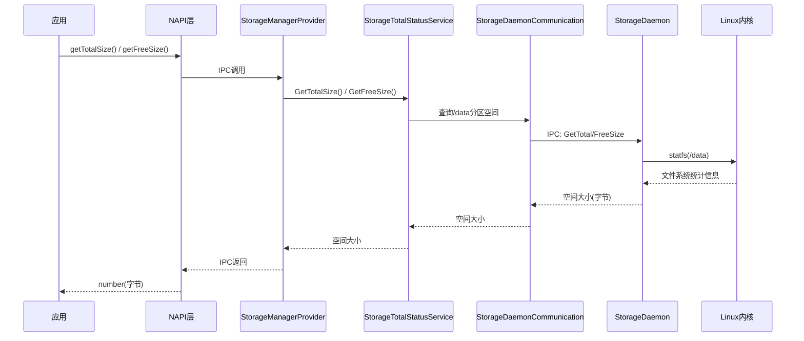
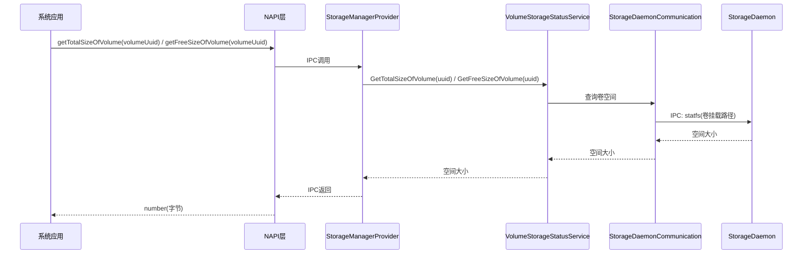

# 总量与可用量查询工作流

## 概述

本文档描述查询内置存储和外置卷设备的总空间与可用空间的完整流程。涉及的接口包括 `getTotalSize`/`getFreeSize`（公共API）以及 `getTotalSizeOfVolume`/`getFreeSizeOfVolume`（系统API）。

## 内置存储查询流程

内置存储的空间查询通过 `StorageTotalStatusService` 服务完成，最终由 `StorageDaemon` 执行 `statfs` 系统调用获取 `/data` 分区的文件系统统计信息。

**流程说明：**

1. 应用层调用 `getTotalSize()` 或 `getFreeSize()` 接口。
2. NAPI层通过IPC将请求发送至 `StorageManagerProvider`。
3. `StorageManagerProvider` 将请求转发给 `StorageTotalStatusService`。
4. `StorageTotalStatusService` 通过 `StorageDaemonCommunication` 向 `StorageDaemon` 发起IPC查询。
5. `StorageDaemon` 对 `/data` 分区执行 `statfs` 系统调用，从Linux内核获取文件系统统计信息。
6. 结果逐层返回，最终以 `number` 类型（字节单位）返回给应用。

## 外置卷设备查询流程

外置卷设备的空间查询通过 `VolumeStorageStatusService` 服务完成，需要指定卷的UUID，由 `StorageDaemon` 对卷的挂载路径执行 `statfs` 系统调用。

**流程说明：**

1. 系统应用调用 `getTotalSizeOfVolume(volumeUuid)` 或 `getFreeSizeOfVolume(volumeUuid)` 接口，传入目标卷的UUID。
2. NAPI层通过IPC将请求发送至 `StorageManagerProvider`。
3. `StorageManagerProvider` 将请求转发给 `VolumeStorageStatusService`。
4. `VolumeStorageStatusService` 通过 `StorageDaemonCommunication` 向 `StorageDaemon` 发起IPC查询。
5. `StorageDaemon` 根据UUID定位卷的挂载路径，执行 `statfs` 系统调用获取文件系统统计信息。
6. 结果逐层返回，最终以 `number` 类型（字节单位）返回给系统应用。

## 同步接口

`getTotalSizeSync()` 和 `getFreeSizeSync()`（API 15+，公共API）直接同步返回结果，不经过 Promise/Callback。这两个接口在 NAPI 层同步执行 IPC 调用，阻塞当前线程直到获取结果后直接返回数值。

## 接口对比

| 接口 | API级别 | 权限 | 查询目标 | 异步方式 |
|------|---------|------|---------|---------|
| getTotalSize | 公共API 15+ | 无 | 内置存储总量 | Promise/Callback/Sync |
| getFreeSize | 公共API 15+ | 无 | 内置存储可用量 | Promise/Callback/Sync |
| getTotalSizeOfVolume | 系统API 8+ | STORAGE_MANAGER | 指定卷总量 | Promise/Callback |
| getFreeSizeOfVolume | 系统API 8+ | STORAGE_MANAGER | 指定卷可用量 | Promise/Callback |
| getSystemSize | 系统API 9+ | STORAGE_MANAGER | 系统数据大小 | Promise/Callback |

**说明：**

- **公共API** 无需特殊权限，任何应用均可调用，用于查询内置存储空间。
- **系统API** 需要 `STORAGE_MANAGER` 权限，仅供系统应用使用，支持按卷UUID查询指定卷的空间。
- `getSystemSize` 用于查询系统数据占用的大小，属于系统API。

## 错误码

| 错误码 | 含义 | 适用接口 |
|--------|------|---------|
| 13600001 | IPC错误 | 所有 |
| 13600008 | 无此对象(卷不存在) | Volume系列 |
| 13900042 | 未知错误 | 所有 |

**错误处理建议：**

- **13600001（IPC错误）**：通常是 `StorageManager` 服务未启动或IPC通信失败，建议检查服务状态并重试。
- **13600008（无此对象）**：指定的卷UUID不存在或卷未挂载，需确认卷状态后重新查询。
- **13900042（未知错误）**：内部异常，需查看日志定位具体原因。

## 关键代码路径

| 流程 | 源码文件 |
|------|---------|
| 总量统计 | services/storage_manager/storage/src/storage_total_status_service.cpp |
| 卷级统计 | services/storage_manager/storage/src/volume_storage_status_service.cpp |
| Daemon查询 | services/storage_daemon/ (statfs系统调用) |
