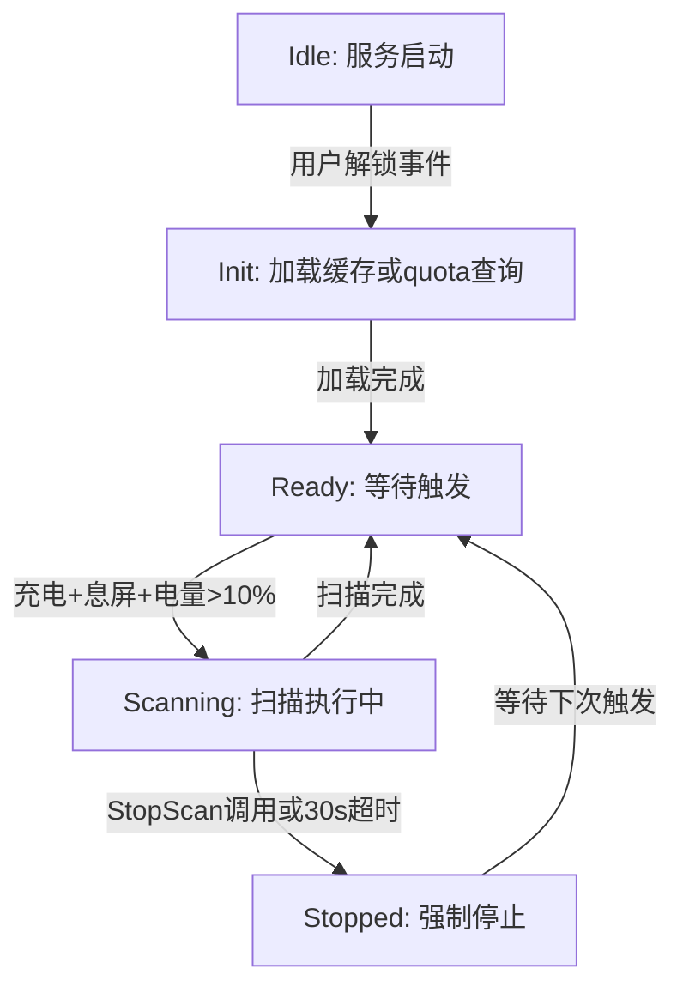
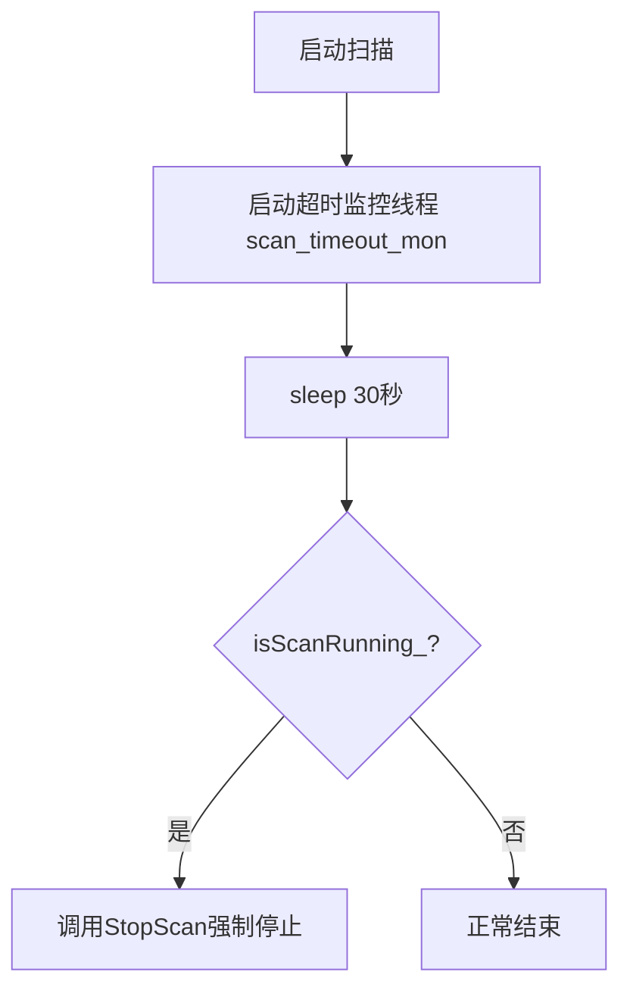

# 磁盘扫描统计工作流

## 概述

StorageManagerScan 通过 quota 查询 + 目录遍历的方式统计 root/system/memmgr 三个系统用户的磁盘空间占用。扫描结果持久化到JSON文件。

## 触发方式

### 触发条件状态图



触发条件说明：
- Init: 监听COMMON_EVENT_USER_UNLOCKED广播
- StartScan: 设备正在充电 + 屏幕关闭 + 电量>10%
- StopScan: 不满足上述条件时
- 防重入: CheckScanPreconditions要求初次扫描或距上次>=24小时

## 扫描执行流程

```mermaid
sequenceDiagram
    participant Event as CommonEventSubscriber
    participant Scan as StorageManagerScan
    participant SDC as StorageDaemonCommunication
    participant SD as StorageDaemon
    participant File as scan_result.json
    participant Radar as StorageRadar

    Event->>Scan: StartScan()
    Scan->>Scan: CheckScanPreconditions()
    alt 距上次扫描<24h
        Scan-->>Event: 拒绝扫描
    else 允许扫描
        Scan->>Scan: LaunchScanWorker()
        Note over Scan: 启动扫描线程(storage_mgr_scan)

        Scan->>SDC: GetDqBlkSpacesByUids(MEMMGR_UID=1111)
        SDC->>SD: IPC: quota查询
        SD-->>SDC: NextDqBlk.dqbCurSpace
        SDC-->>Scan: memmgrQuotaSize

        Scan->>SDC: GetDirListSpaceByPaths(白名单目录, [ROOT_UID, SYSTEM_UID])
        Note over Scan: 白名单: /data/service/el0, /data/service/el1, /data/chipset/el1, /data/log, /data/local, /data/vendor, /data/hisi_logs

白名单目录列表定义在 StorageManagerScan::GetDirWhiteList() 方法中（storage_manager_scan.cpp），完整列表以源码为准。
        SDC->>SD: IPC: 目录遍历
        SD-->>SDC: 各目录按UID归类的大小
        SDC-->>Scan: rootSize + systemSize

        Scan->>SDC: GetDirListSpace(/data/service/el1/0/hyperhold)
        SDC->>SD: IPC: 目录扫描
        SD-->>SDC: hyperholdSize
        SDC-->>Scan: hyperholdRootSize

        Scan->>SDC: GetDirListSpace(/data/service/el1/public/rgm_manager)
        SDC-->>Scan: rgmManagerRootSize

        Scan->>Scan: CalculateFinalSizes()
        Note over Scan: rootSize = dirScanRoot - hyperhold - rgm_manager
        Note over Scan: systemSize = dirScanSystem
        Note over Scan: memmgrSize = memmgrQuota + hyperhold

        Scan->>File: SaveScanResultToFile()
        Note over File: JSON: rootSize, systemSize, memmgrSize
        Scan->>Radar: ReportScanResult()
        Scan->>Scan: isScanRunning_ = false
    end
```

## 超时保护机制



30秒超时值为代码中硬编码的常量（非系统参数配置），定义在 StorageManagerScan::LaunchScanWorker() 中。

## 持久化文件

路径: /data/service/el1/public/storage_manager/database/scan_result.json
格式: {"rootSize":xxx, "systemSize":xxx, "memmgrSize":xxx}

Init时优先从文件加载缓存，避免启动时立即扫描。

## 关键代码路径

| 流程 | 源码文件 |
|------|---------|
| 扫描主逻辑 | services/storage_manager/scan/src/storage_manager_scan.cpp |
| 扫描头文件 | services/storage_manager/include/scan/storage_manager_scan.h |
| 事件触发 | services/storage_manager/common_event/storage_common_event_subscriber.cpp |
| IPC通信 | services/storage_manager/storage_daemon_communication/ |
| Daemon执行 | services/storage_daemon/ (quota查询/目录遍历) |
| 数据结构 | interfaces/innerkits/storage_manager/native/statistic_info.h |
