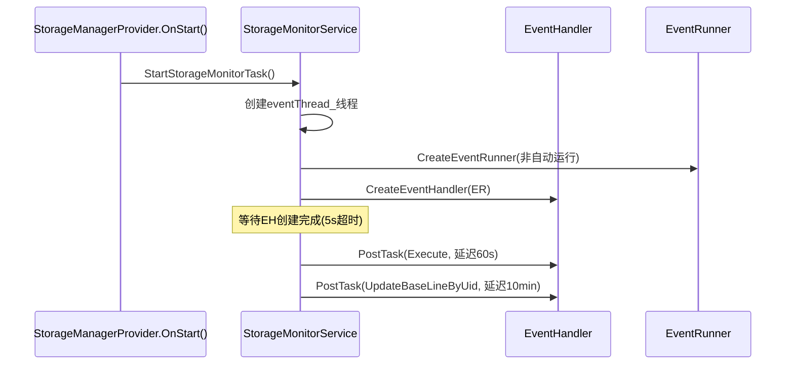
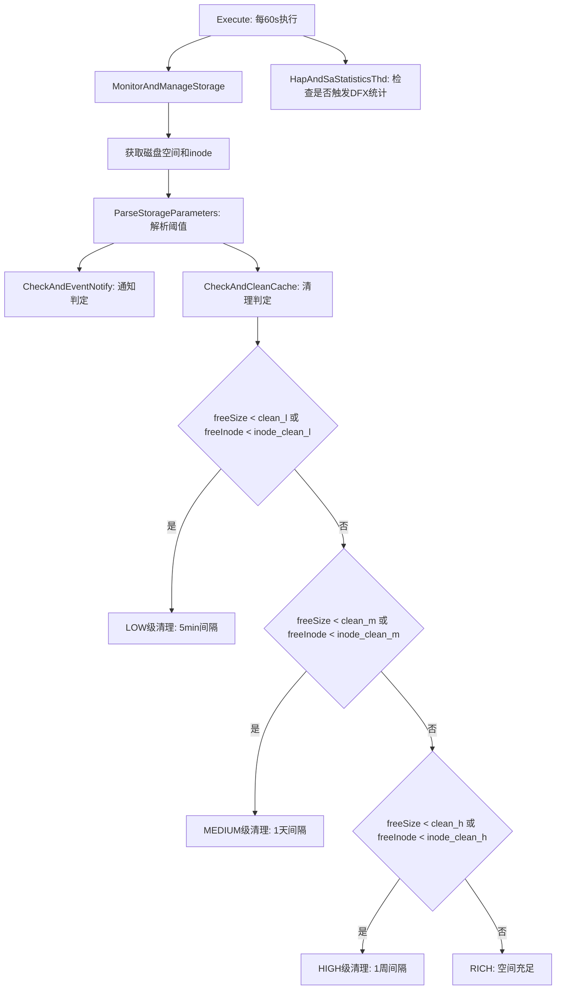
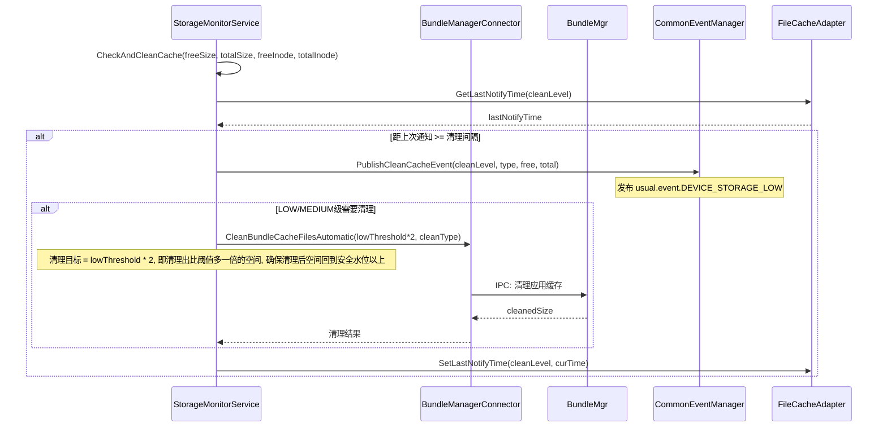
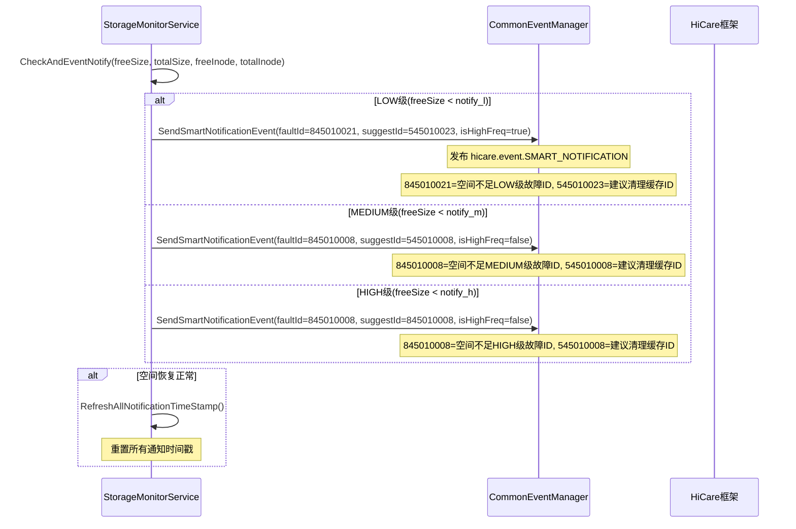

# 存储监控与自动清理工作流

## 概述

StorageMonitorService 是单例服务，每60秒执行一次磁盘空间监控，根据三级阈值体系判定是否需要发送通知和清理缓存。

## 服务启动流程

## 周期监控流程

## 清理执行流程

## 通知流程

## 阈值参数配置

空间阈值参数: const.storage_service.storage_alert_policy
默认值: notify_l:500M/notify_m:2G/notify_h:10%/clean_l:750M/clean_m:5%/clean_h:12%
支持单位: M(MB), G(GB), %(百分比)

Inode阈值参数: const.storage_service.inode_alert_policy
默认值: notify_l:25000/notify_m:100000/notify_h:10%/clean_l:37500/clean_m:5%/clean_h:12%
支持具体数值和百分比

### 时间阈值常量

| 常量 | 值 | 说明 | 是否可配置 |
|------|-----|------|-----------|
| DEFAULT_CHECK_INTERVAL | 60s | 周期监控间隔 | 否（代码常量） |
| LOW级清理间隔 | 300s/3600s | 清理效果不达标时升级 | 否（代码常量） |
| MEDIUM级清理间隔 | 86400s | 1天 | 否（代码常量） |
| HIGH级清理间隔 | 604800s | 1周 | 否（代码常量） |
| LOW级通知间隔 | 300s | 5分钟高频 | 否（代码常量） |
| MEDIUM/HIGH级通知间隔 | 86400s | 24小时 | 否（代码常量） |

## 关键代码路径

| 流程 | 源码文件 |
|------|---------|
| 监控主逻辑 | services/storage_manager/storage/src/storage_monitor_service.cpp |
| 启动入口 | services/storage_manager/ipc/src/storage_manager_provider.cpp |
| 包管理清理 | services/storage_manager/storage/src/bundle_manager_connector.cpp |
| 配额基线 | services/storage_manager/storage/src/storage_quota_controller.cpp |
| 文件缓存 | services/storage_manager/utils/file_cache_adapter.cpp |
| 常量定义 | services/common/include/storage_service_constant.h |
