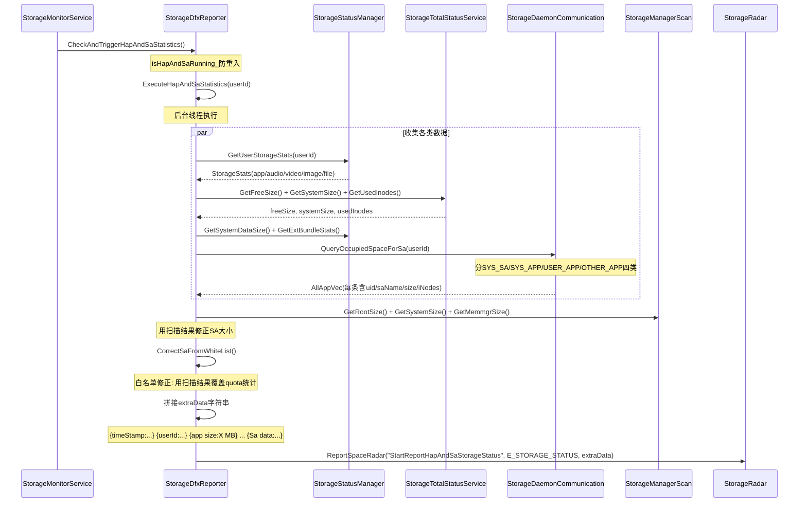
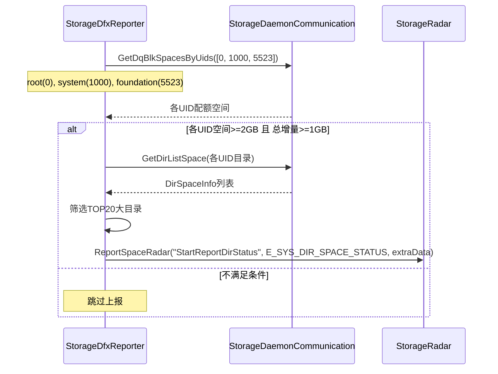

# DFX统计上报工作流

## 概述

StorageDfxReporter 负责将存储空间统计信息定时上报到雷达平台（通过StorageRadar::ReportSpaceRadar），用于运维监控和问题定位。

## 上报类型概览

| 类型 | 方法名 | 触发时机 | 上报内容 |
|------|--------|---------|---------|
| HAP/SA统计 | StartReportHapAndSaStorageStatus | 每天0:00/8:00/16:00 | 应用和SA的分类空间占用 |
| 目录统计 | StartReportDirStatus | 目录空间增量>=1GB | root/system/foundation的TOP20目录 |
| 扫描结果 | ReportScanResult | 扫描完成后 | root/system/memmgr占用+大文件+大目录 |

## HAP/SA统计上报流程

## 上报数据字段

HAP/SA统计上报的extraData包含：
- {timeStamp:..., time:...} — 时间信息
- {userId is:100} — 用户ID
- {app size:X MB, audio size:X MB, image size:X MB, video size:X MB, file size:X MB, total size:X MB} — 各类空间占用
- {sys size:X MB, free size:X MB, sys data size:X MB, ext bundle size:X MB} — 系统空间信息
- {main_blkaddr data:X MB, ovp_chunks data:X MB, metaData:X MB} — HMFS元数据
- {anco image size:X MB} — ANCO镜像
- {iNodes count:X, iNodes size:X MB} — inode使用
- {sa totalSize:X MB, other totalSize:X MB} — SA及非SA应用总占用
- {Sa data:uid:X,saName:XXX,size:X MB,iNodes:X} — 四类应用详情

## 目录统计上报流程

## 定时触发机制

HapAndSaStatisticsThd() 在 StorageMonitorService 的60秒周期任务中检查：
- 当前时间在 0:00/8:00/16:00 且分钟为0或1时触发
- 使用 isHapAndSaRunning_ 原子变量防重入

## 关键代码路径

| 流程 | 源码文件 |
|------|---------|
| DFX上报 | services/storage_manager/dfx_report/storage_dfx_reporter.cpp |
| 雷达打点 | services/storage_daemon/include/utils/storage_radar.h |
| 定时触发 | services/storage_manager/storage/src/storage_monitor_service.cpp |
| 数据结构 | interfaces/innerkits/storage_manager/native/statistic_info.h |
