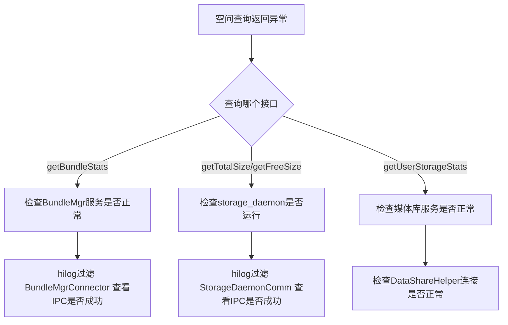

# 调试与排障

## 1. 日志标签

| 模块 | 日志标签 | 说明 |
|------|---------|------|
| StorageManagerProvider | StorageManager | SA入口，IPC分发 |
| StorageStatusManager | StorageStatusMgr | 应用/用户空间统计 |
| StorageTotalStatusService | StorageTotalStatus | 总量/可用量查询 |
| StorageMonitorService | StorageMonitor | 存储监控与清理 |
| StorageManagerScan | StorageScan | 磁盘扫描 |
| StorageDfxReporter | StorageDfxReport | DFX上报 |
| StorageDaemonCommunication | StorageDaemonComm | IPC通信 |
| BundleManagerConnector | BundleMgrConnector | 包管理连接 |

### 日志查看命令

```bash
# 查看storage_manager所有日志
hilog | grep -E "StorageManager|StorageStatusMgr|StorageTotalStatus|StorageMonitor|StorageScan|StorageDfxReport"

# 仅查看空间统计相关日志
hilog | grep -E "BundleStats|StorageStats|GetTotalSize|GetFreeSize|GetBundleStats"

# 查看扫描相关日志
hilog | grep "StorageScan"

# 查看监控与清理日志
hilog | grep "StorageMonitor"
```

---

## 2. 雷达打点

所有空间统计相关的DFX数据通过 StorageRadar::ReportSpaceRadar 上报到 HiSysEvent 平台。

### 打点事件列表

| 事件名称 | 错误码常量 | 触发时机 |
|----------|-----------|---------|
| StartReportHapAndSaStorageStatus | E_STORAGE_STATUS | HAP/SA统计上报 |
| StartReportDirStatus | E_SYS_DIR_SPACE_STATUS | 目录统计上报 |
| StorageManagerScan | E_SCAN_RESULT | 扫描结果上报 |
| LargeFilesAndDirs | E_SCAN_RESULT | 大文件/大目录上报 |
| BIZ_STAGE_THRESHOLD_CLEAN_LOW | - | LOW级清理 |
| BIZ_STAGE_THRESHOLD_CLEAN_MEDIUM | - | MEDIUM级清理 |
| BIZ_STAGE_THRESHOLD_CLEAN_HIGH | - | HIGH级清理 |
| BIZ_STAGE_THRESHOLD_NOTIFY_LOW | - | LOW级通知 |
| BIZ_STAGE_THRESHOLD_NOTIFY_MEDIUM | - | MEDIUM级通知 |

---

## 3. 故障排查流程

### 空间查询返回0或异常值



### 排查规则（WHEN/THEN）

- WHEN getBundleStats 返回 0 THEN 检查 BundleMgr 服务是否正常: `hilog | grep BundleMgrConnector`
- WHEN getTotalSize/getFreeSize 返回异常 THEN 检查 storage_daemon 进程: `ps -ef | grep storage_daemon`
- WHEN getUserStorageStats 返回 13600001 THEN 检查 storage_manager SA状态: `sa_checker storage_manager`
- WHEN 存储监控不触发清理 THEN 依次检查: ①StorageMonitorService是否启动 ②阈值参数是否正确 ③当前空间是否低于阈值 ④清理间隔是否已到
- WHEN 扫描不执行 THEN 检查: ①充电+息屏+电量条件 ②距上次扫描是否超24h ③scan_result.json修改时间

### 存储监控不触发清理

排查步骤：
1. 检查StorageMonitorService是否启动: `hilog | grep "StorageMonitor"`
2. 检查阈值参数是否正确: `param get const.storage_service.storage_alert_policy`
3. 检查当前空间是否真的低于阈值: `hilog | grep "freeSize"`
4. 检查清理事件发送间隔是否已到: 查看FileCacheAdapter中的lastNotifyTime
5. 检查BundleMgr缓存清理是否成功: `hilog | grep "CleanBundleCache"`

### 扫描不执行或卡住

排查步骤：
1. 检查触发条件是否满足: 充电+息屏+电量>10%
2. 检查距上次扫描是否超过24小时: 查看 scan_result.json 的修改时间
3. 检查是否有扫描超时(30s): `hilog | grep "scan_timeout_mon"`
4. 检查storage_daemon的stopScanFlag是否误置为true

### DFX上报数据缺失

排查步骤：
1. 确认定时触发时间点: 0:00/8:00/16:00
2. 检查防重入标志: isHapAndSaRunning_
3. 检查雷达打点是否成功: `hilog | grep "ReportSpaceRadar"`
4. 检查目录上报条件: UID空间>=2GB，增量>=1GB

---

## 4. 常用调试命令

```bash
# 查看当前磁盘空间
df -h /data

# 查看inode使用情况
df -i /data

# 查看quota设置
repquota -a

# 查看扫描结果缓存
cat /data/service/el1/public/storage_manager/database/scan_result.json

# 查看阈值配置
param get const.storage_service.storage_alert_policy
param get const.storage_service.inode_alert_policy

# 查看storage_manager SA状态
sa_checker storage_manager

# 查看storage_daemon进程
ps -ef | grep storage_daemon
```

---

## 5. 错误码速查

| 错误码 | 常量名 | 含义 | 常见原因 |
|--------|--------|------|---------|
| 13600001 | E_IPC_ERROR | IPC通信错误 | 对端服务未启动或IPC代理失效 |
| 13600008 | E_NO_SUCH_OBJECT | 对象不存在 | 卷UUID错误或应用包名不存在 |
| 13600009 | E_USER_ID_RANGE | 用户ID超出范围 | userId参数不合法 |
| 13900042 | E_UNKNOWN_ERROR | 兜底错误码，内部未预期异常 | 触发时通过hilog过滤 StorageStatusMgr/StorageTotalStatus 定位具体异常，常见原因：statfs系统调用失败、媒体库查询异常 |
